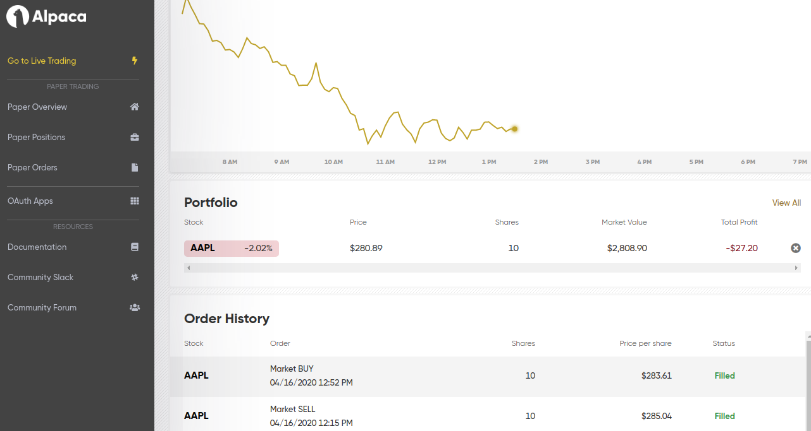

# AI_stock_trading

This repo has the Pytorch implementation to perform AI based trade in live environment. It uses Python API from Alpaca and deploys the model in AWS cloud environment.

To follow along, please check the Medium article: [24x5 Stock Trading Agent to predict stock prices with Deep Learning with deployment](https://towardsdatascience.com/24x5-stock-trading-agent-to-predict-stock-prices-with-deep-learning-with-deployment-c15570720ae9).

## Architecture
1. Connect Alpaca brokerage account
2. Get historical data using polygon API
3. Train a simple AI model using AWS cloud
4. Deploy the model in AWS Sagemaker
5. Trade in real-time

## Results

Results after buying and selling

## Author

**Shyam BV**

[**GITHUB**](https://github.com/bvshyam)

[**BLOG**](https://medium.com/@bv.shyam)

